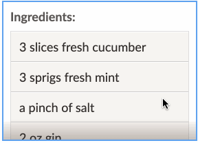
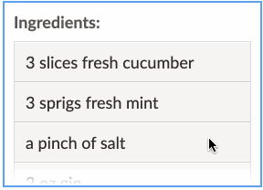
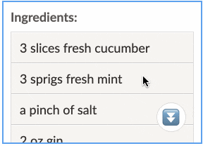

# react-overflow-indicator ⏬

- Let users know when there’s more content to see in an `overflow` container, in
  case their device hides scrollbars.
- Uses
  [Intersection Observer](https://developer.mozilla.org/en-US/docs/Web/API/IntersectionObserver)
  for performance and accuracy – no listening for `scroll` or `resize` events.
- Flexible: render any style of indicator you want (shadows, arrows, messages,
  etc.) wherever you want, using any styling solution.

<table>
<thead>
<tr>
<th colspan="3">
Some examples: shadows, fades, icons…
</th>
</tr>
</thead>
<tbody>
<tr>
<td>



</td>
<td>



</td>
<td>



</td>
</tr>
</tbody>
</table>

## Quick Start

Install:

```console
$ yarn add react-overflow-indicator
```

Import:

```js
import Overflow from 'react-overflow-indicator';
```

Render indicators automatically using `<Overflow.Indicator>` inside of
`<Overflow>`:

```jsx
<Overflow>
  <Overflow.Content>
    Render an element or put your content directly here…
  </Overflow.Content>
  <Overflow.Indicator direction="down">👇</Overflow.Indicator>
</Overflow>
```

…or, use the `onStateChange` prop to react to overflow however you like:

```jsx
const [canScroll, setCanScroll] = useState(false);

return (
  <>
    <Overflow onStateChange={state => setCanScroll(state.canScroll.down)}>
      <Overflow.Content>
        Render an element or put your content directly here…
      </Overflow.Content>
    </Overflow>
    {canScrollDown ? '👇' : '🌈'}
  </>
);
```

## API

<!-- AUTO-GENERATED-CONTENT:START (COMPONENTS) -->

### Overflow

The overflow state provider. At a minimum it must contain an
`<Overflow.Content>` element, otherwise it will do nothing.

```jsx
<Overflow>
  <Overflow.Content>
    Your element(s) here!
  </Overflow.Content>
<Overflow>
```

As with any standard element, its height must be limited in some way in order
for it to actually scroll. Apply that style as you would any other element, with
`style` or `className`:

```jsx
<Overflow style={{ maxHeight: 500 }}>…</Overflow>
```

Usage with styled-components:

```jsx
const MyContainer = styled(Overflow)`
  max-height: 500px;
`;
```

Any remaining props beyond those documented below will be passed along to the
underlying DOM element. Use this to pass `className`, `style`, or any other
native attribute.

#### Props

<table>
<thead>
<tr>
<th>Name</th>
<th colspan="2">Type</th>
<th>Default</th>
<th>Description</th>
</tr>
</thead>
<tbody>
<tr>
<td valign="top" rowspan="1">children</td>
<td valign="top" colspan="2">Node</td>
<td valign="top" align="right" rowspan="1"></td>
<td valign="top" valign="top" rowspan="1">

Elements to render inside the outer container. This should include an
`<Overflow.Content>` element at a minimum, but should also include your scroll
indicators if you’d like to overlay them on the scrollable viewport.

</td>
</tr>
<tr>
<td valign="top" rowspan="1">onStateChange</td>
<td valign="top" colspan="2">Function</td>
<td valign="top" align="right" rowspan="1"></td>
<td valign="top" valign="top" rowspan="1">

Callback that receives the latest overflow state and an object of refs, if you’d
like to react to overflow in a custom way.

</td>
</tr>
<tr>
<td valign="top" rowspan="1">tolerance</td>
<td valign="top" colspan="2">
One&nbsp;of… <br>
&nbsp;&nbsp;Number <br>
&nbsp;&nbsp;String
</td>
<td valign="top" align="right" rowspan="1">0</td>
<td valign="top" valign="top" rowspan="1">

Distance (number of pixels or CSS length unit like `1em`) to the edge of the
content at which to consider the viewport fully scrolled. For example, if set to
10, then it will consider scrolling to have reached the end as long as it’s
within 10 pixels of the border. You can use this when your content has padding
and scrolling close to the edge should be good enough.

</td>
</tr>
</tbody>
</table>

### Overflow.Content

Wrapper for content to render inside the scrollable viewport. This element will
grow to whatever size it needs to hold its content, and will cause the parent
viewport element to overflow. It must be rendered inside an `<Overflow>`
ancestor.

Although you can style this element directly by passing additional props like
`className` and `style`, it’s preferable to include styling on your own element
inside `<Overflow.Content>` instead – otherwise you risk interfering with the
styles this component needs to function.

#### Props

<table>
<thead>
<tr>
<th>Name</th>
<th colspan="2">Type</th>
<th>Default</th>
<th>Description</th>
</tr>
</thead>
<tbody>
<tr>
<td valign="top" rowspan="1">children</td>
<td valign="top" colspan="2">Node</td>
<td valign="top" align="right" rowspan="1"></td>
<td valign="top" valign="top" rowspan="1">

Content to render inside the scrollable viewport.

</td>
</tr>
</tbody>
</table>

### Overflow.Indicator

A helper component for rendering your custom indicator when the viewport is
scrollable in a particular direction (or any direction). Must be rendered inside
an `<Overflow>` ancestor.

You can provide a `direction` prop to indicate when scrolling is allowed in a
particular direction:

```jsx
<Overflow>
  <Overflow.Content>…</Overflow.Content>
  <Overflow.Indicator direction="right">👉</Overflow.Indicator>
</Overflow>
```

…or exclude it to indicate when scrolling is allowed in any direction:

```jsx
<Overflow>
  <Overflow.Content>…</Overflow.Content>
  <Overflow.Indicator>←↕→</Overflow.Indicator>
</Overflow>
```

This component will mount its children when scrolling is allowed in the
requested direction, and unmount them otherwise. If you’d rather remain mounted
(to allow transitions, for example), then render a function. It will be supplied
with a Boolean (if `direction` is supplied) or an object with `up`, `left`,
`right`, and `down` properties:

```jsx
<Overflow>
  <Overflow.Indicator direction="down">
    {canScroll => (canScroll ? '🔽' : '✅')}
  </Overflow.Indicator>
</Overflow>
```

#### Props

<table>
<thead>
<tr>
<th>Name</th>
<th colspan="2">Type</th>
<th>Default</th>
<th>Description</th>
</tr>
</thead>
<tbody>
<tr>
<td valign="top" rowspan="1">children</td>
<td valign="top" colspan="2">
One&nbsp;of… <br>
&nbsp;&nbsp;Node <br>
&nbsp;&nbsp;Function
</td>
<td valign="top" align="right" rowspan="1"></td>
<td valign="top" valign="top" rowspan="1">

Indicator to render when scrolling is allowed in the requested direction. If
given a function, it will be passed the overflow state and an object containing
the `viewport` ref. You can use this `refs` parameter to render an indicator
that is also a button that scrolls the viewport (for example).

</td>
</tr>
<tr>
<td valign="top" rowspan="1">direction</td>
<td valign="top" colspan="2">
One&nbsp;of… <br>
&nbsp;&nbsp;'up' <br>
&nbsp;&nbsp;'down' <br>
&nbsp;&nbsp;'left' <br>
&nbsp;&nbsp;'right'
</td>
<td valign="top" align="right" rowspan="1"></td>
<td valign="top" valign="top" rowspan="1">

The scrollabe direction to watch for. If not supplied, the indicator will be
active when scrolling is allowed in any direction.

</td>
</tr>
</tbody>
</table>
<!-- AUTO-GENERATED-CONTENT:END -->

### useOverflow

This hook provides full access to the Overflow’s context containing its current
`state` and `refs`. While `<Overflow.Indicator>` should be good enough for most
use cases, you can use this if you have other use cases in mind. Must be used
inside an `<Overflow>` ancestor.

Returns an object like:

```js
{
  state: {
    canScroll: {
      up: Boolean,
      left: Boolean,
      right: Boolean,
      down: Boolean
    }
  },
  dispatch: Function,
  tolerance: Number | String,
  refs: {
    viewport: Object
  }
}
```

## Examples

### Make the indicator a button that scrolls the viewport

```jsx
<Overflow.Indicator direction="down">
  {(canScroll, refs) => (
    <button
      type="button"
      onClick={() => {
        refs.viewport.current.scrollBy({
          top: refs.viewport.current.clientHeight,
          behavior: 'smooth'
        });
      }}
      style={{ position: 'absolute', right: 10, bottom: 10 }}
    >
      {canScroll ? '⏬' : '✅'}
    </button>
  )}
</Overflow.Indicator>
```

## Implementation Details

Instead of the traditional method of listening for `scroll` and `resize` events,
this uses the more performant
[Intersection Observer API](https://developer.mozilla.org/en-US/docs/Web/API/Intersection_Observer_API).

Here, an `IntersectionObserver` watches each of the 4 sides of the viewport
element to see when the scrollable content extends past that edge.

### What’s the purpose of each element?

When rendered, you’ll see a structure similar to this:

```
<div data-overflow-wrapper>
  <div data-overflow-viewport>
    <div data-overflow-content>
      <div data-overflow-tolerance></div> (Optional)
      Finally, your scrollable content here…
    </div>
  </div>
</div>
```

That seems like a lot! But each one serves a purpose – various CSS and DOM
behaviors make this surprisingly difficult to implement otherwise.

From the top down:

- The element with `data-scrollable-wrapper` contains everything. If you want to
  insert some indicator overlay (like shadows, an arrow, a floating message),
  they should usually be children of this element so that they’ll be siblings of
  the scrollable viewport and thus will remain in their positions instead of
  scrolling away. When you define a `height` or `max-height` to define the
  scrollable viewport size, it will be on this element.
- The element with `data-scrollable-viewport` is the one with `overflow: auto`.
  It will match the size of its parent (the `data-scrollable-wrapper`). Any
  indicators you render will usually be siblings of this element.
- The element with `data-scrollable-content` contains your content. It will grow
  to whatever size it needs and potentially cause the `data-scrollable-viewport`
  element to overflow.
- The element with `data-scrollable-tolerance` will optionally be inserted if
  you use a nonzero `tolerance` value; in that case, this element will be
  observed instead of the content element.
